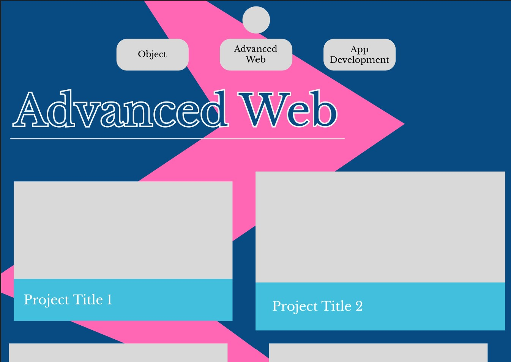
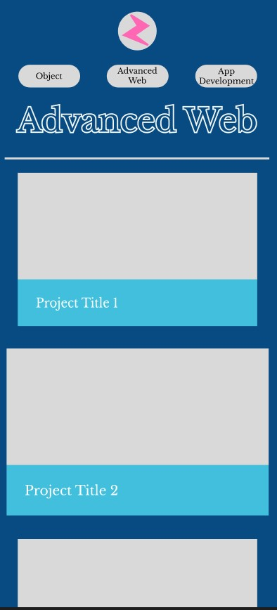
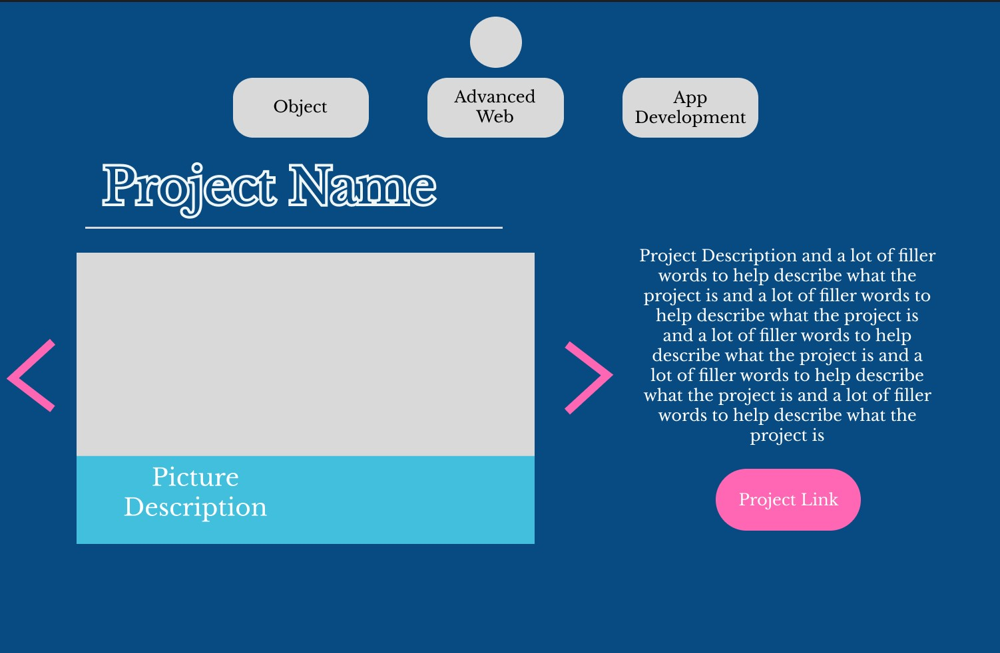

# Classroom Portal Beta Design

This project holding all my other projects, I wanted it to shout me a bit more "me," than future projects. 

## Colors 

So of course we had to spend time focusing on colorscheme.  That made me go to Coloors and I found 5 different color schemes that I thought worked well.  But that made be decide to go with the color scheme below.

With these I planned on #084B83 as background colors, #42BFDD and #BBE6E4 as secondary colors, #F0F6F6 for text and #FF66B3 for Highlights.  This resulted in the following theme below.

## Layout

I wanted to keep it simplistic but showcase the projects as they are probably the most important part.  The idea was with a big screen, the cells would be in rows of 3, medium would be rows of 2 and cell phone would result in a single column. The background is still up in the air as I don't like how "2D" it looks now.

#### Top Button

Hoping to use an interactble button to toggle access to other classes.  Might use as my site for self advertisement so classes might become its own tab with mutliple subtabs.  The button will contain a CSS animation upon clcikng to allow for fluidity.

### On web browser

### On Phone

## Project Page

The Project Page is simple but I do not believe that there is anything wrong with that.  It contains multiple pictures of the project and overall discription and a link to the project and/or a download for said project.

## Planned Changed

I want to add more depth to the site but am trying to figure out how.  Might add pictures of mountains or something, people like those.