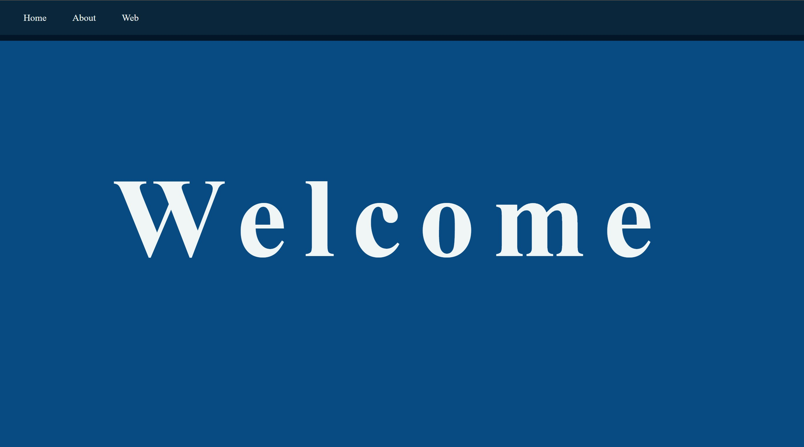
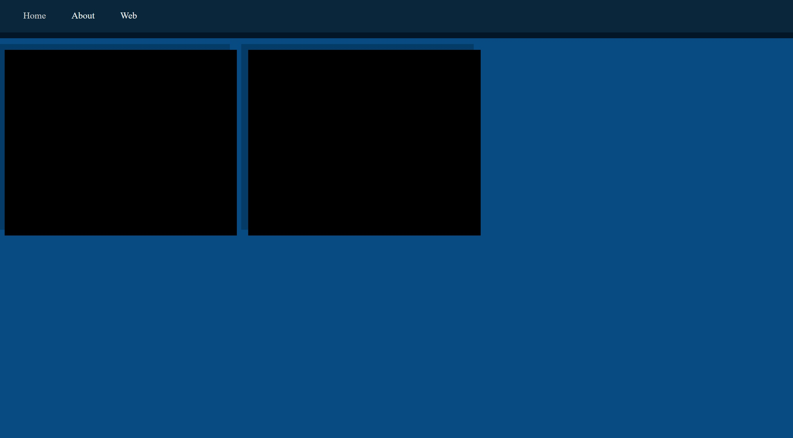
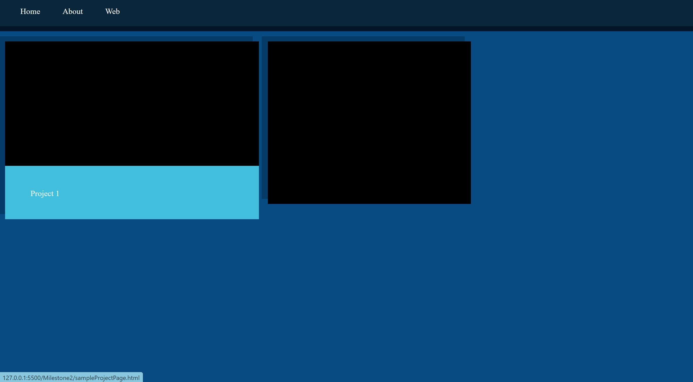
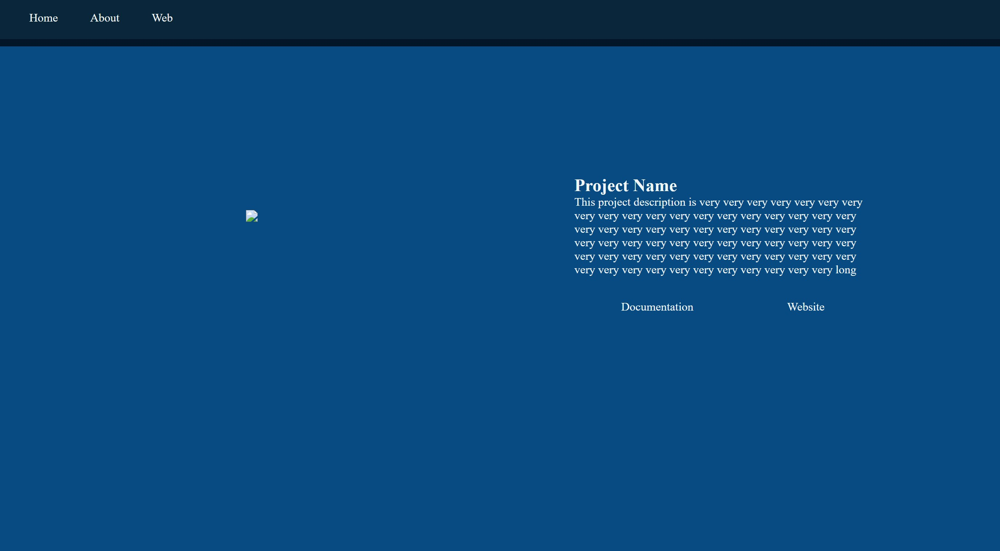

# Classroom Portal "Finished" Design

It's always weird creating an empty portal.  So much you get to add but so much of it empty due to a lack of projects to fill it with.  Either way, here is the shell that will become my portal come the end of the semester. 

## End Design

The basics of the portal is here and present.  We got a simple navbar on every page and a navy blue (#084B83) base for a color scheme with a light blue (#42BFDD) for highlights. 

Used a few CSS animations to make the site feel smoother but this came at a cost of some website flexability (working on fixing this). 

## Home Page

The Home Page I designed to be simple, I didn't want anything flashy and overwelming but wanted to five the idea of "coding" so I decided to create a typing effect on the "Welcome!"  

## About

This I couldn't really work on,  This is just gonna be a simple page with what I do, what I like and how to contact me.

### To-do for this page

* Fill it out

* Find a profile picture

## Projects

This page will hold all the projects I will work on for this class.  The Div will contain a single (and probably best presenting) photo from the bunch I take for documentation.  Upon hovering the cell for each project, will present it's name and increase in size about 15%. 

### To-do for this page

* Create a class description
* Throw the first assignment into the portal

## Single Project Page

For this page I wanted to allow multiple photos to be looked at, especially for bigger projects so I'm working on a carosel for individual projects.  It will contain a link to the project site and a link to the project write-up.  Also will contain a breif description of the project.

### To-do for this page

* Make the carosel work

## Biggest Challenges

* Animations took forever, I wanted to make sure I exculsivly used CSS animations meaning no Javascript for animations
* It was way to tricky to add the pink highlights but I still want to to add flexability
* The animations were tricky to adapt to multiple sizes of screens and I still can't get the opening page to adjust

## Other General To-Do

* Create a dropdown menu for classes as opposed to just having all my classes in the navbar
* Add the pink highlights
* Change the menu to more of the idea of what I had in my inital plan
* Adapt "Welcome!" animation to smaller screens