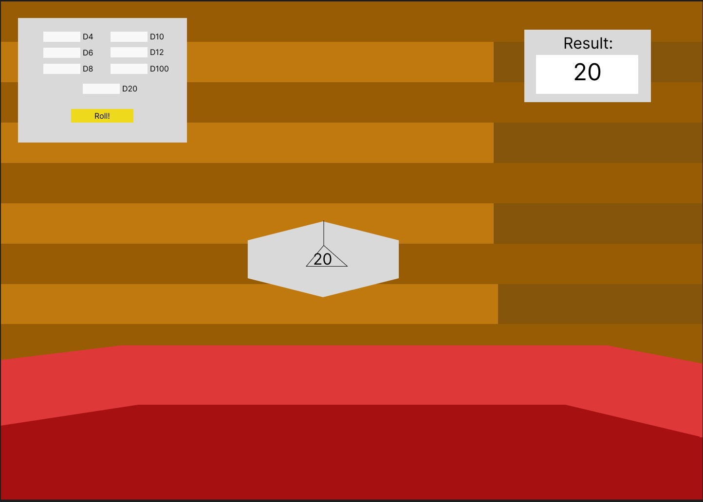

# Project 1 - Modern JavaScript Web Application - Dice Roller

So... I am an avid dungeons and dragons nerd and as such I've always wanted an online dice roller.  But most are boring either just generating the numbers or showing the mnumber on a 2d PNG.  Nah nah nah, we ain't doing nothing that lazy.  I want to make a 3D dice roller for online use that anyone could use.  Rolling anything from a D4 to a D20 and as many as you want.  (Might limit at about 20 dice so it doesn't break computers). You could roll multiple of many dice to so you want a d4, a d12 and a d100, roll them and the dice will spawn into the given area. 

## Quick mockup

This is gonna be a single page site to start.  I want it to work before I make it flashy.  I would have 2 seperate terminals in the sight on top of where the dice are being rolled.  One would be selecting which dice you want rolled and how much of each.  The second is the results so you don't have to try to figure out what the dice say (might only use this if dice of one type is rolled I.E. all d6's).

## How we gonna JS?

Well, I sorta need RNG generator to figure out what side of the dice it will land on. Also to generate the 3d objects, I can't really just do that in HTML and CSS.  I want it to look like a natural dice roll.

## What we gonna use

I need to use two things in particular.  Firstly, I need to use a 3d modeling software.  Probably Blender or Solidworks.  Secondly I need to learn Three.JS.  This will allow me to implement 3d models into the website.

## Responsiveness 

I will more than likely be able to size something to each screen.  If the screen is bigger, bigger d20 and area to roll it in. I don't only want one dice to be able to fit on a phone, I want them to be able to work the application all the same.

### Goals:
* Prototyping: I want a dice to be able to roll.  Weather I am able to get the result or not or dictate which dice isn't as important as the dice being able to roll itself.
* MVP:  We get to what I have in the wireframe.  Multiple dice and which dice as well as reading the result would be wonderful and I think I will be passed the biggest chunk of Three.JS at that point.
* Stretch: Clean the site up.  Currently it is just one page and I think that page will work alright enough but it won't look the cleanest.  This could include a start page, a better reset button to decide when they want the dice gone or maybe weirdly sided dice.