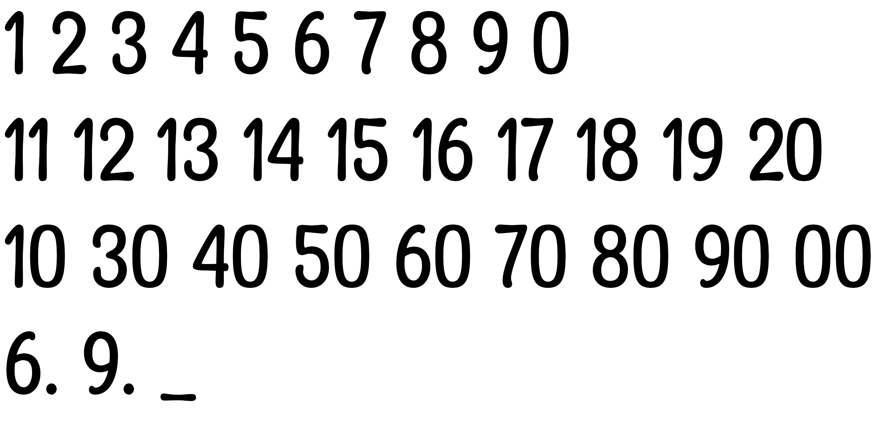
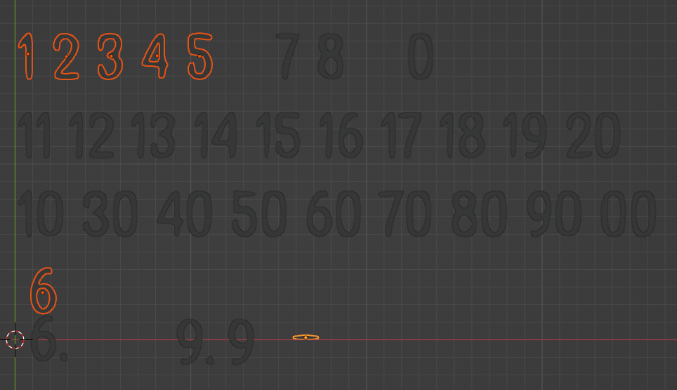
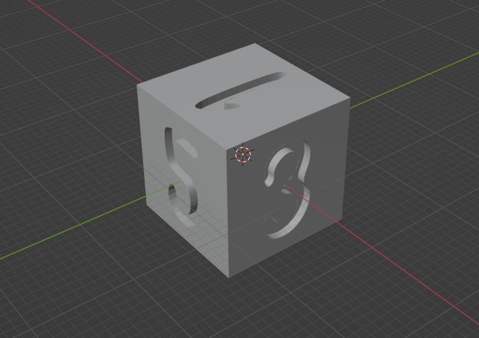

# Milestone 2

Let me start by saying I am nowhere where I want to be but at the same time, learning Blender and 2 JS libraries (Three.JS and cannon-es) is tricky during midterms week.  I have watched tutorials on the libraries but have yet to do much code as I have been working on blender for the most part

## What I have gotten done

First I wanted to find a right font for the dice, so we found Mangaby, a comfortable fancy font.

Then we turned the numbers into 3d objects which I began to use on the dice.

The I managed to make a D6 dice.  This is the first of the set and it should be smoother sailing for the rest of them.

## Goals set

* I want to finish the dice set by the weekend (D4, D8, D10, D100, D12 and D20)
* Next Tuesday I should complete a physics engine where one dice can roll. 
* Be able to Roll multiple by Critique day

## Scrapped

* I don't know if I'll be able to read the dice numbers.  I honestly can't think of a way to create this besides predestined animations for each dice which doesn't feel natural.  I still want it to feel random.

Again, this has been a full week and hopefully I'll be able to get a lot more done next week.