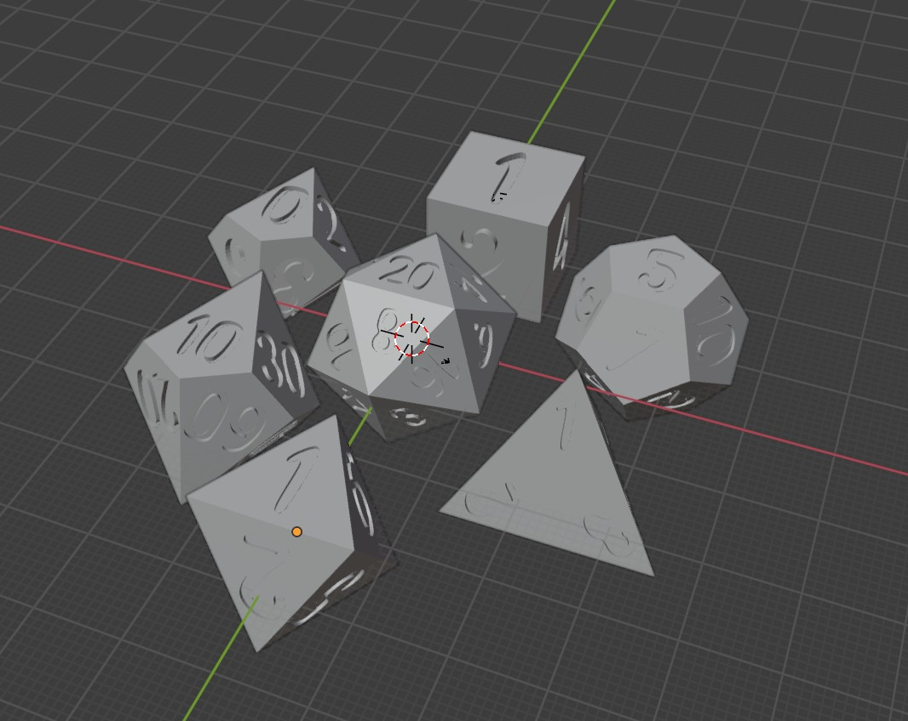
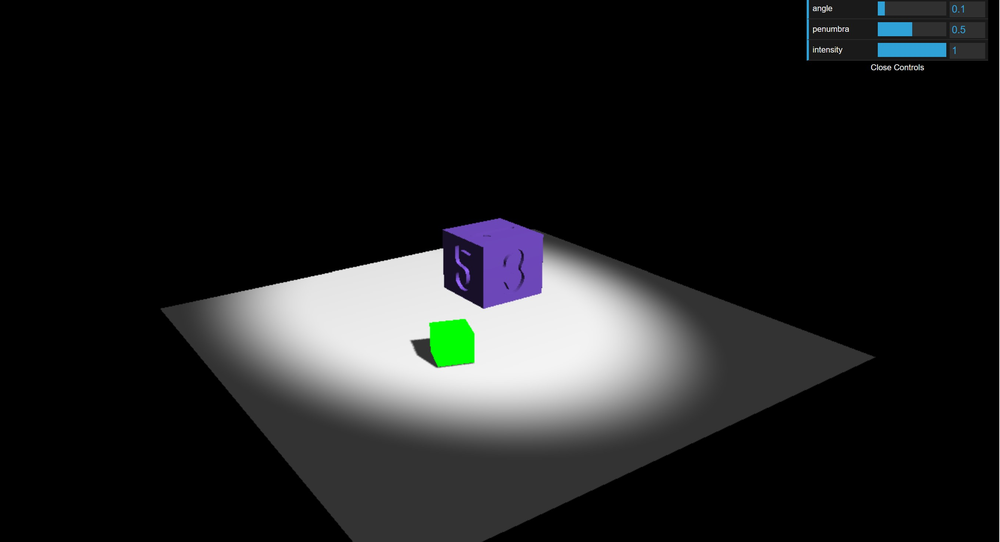

# Online Dice Simulator

A project designed in three.js and cannon-es, I want to be able to roll different sided dice online without it just being a random number generator.  

## First Steps

To begin, I started both learning the libraries better and also modeling all 7 of the dice (D4, D6, D8, D10, D100, D12 and D20) in blender. After doing so we hopped into the website!

Afterwards, we needed to set up a physical plane and get a simulated dice rolling. The issue came when mapping the dice which I am still working on. 

## Next Steps

I am nowhere done, there are multiple parts I still wish to incorperate into this project:

- [ ] Map the Dice to the given created blender model.
- [ ] Create a rollable model for each of the dice.
- [ ] roll mutiple dice at once.
- [ ] sum up the dice total.

## Reflection

Ho Boy I got nothing I wanted to get done.  This became much more of a "Learn Three.JS and Cannon-es" project and I am okay with that.  Both crazy trickly librariies as physics and 3d spaces aren't my forte.  With that in mind, I want to be able to push this website further, with or without a grade.  As listed above, I have plans for what more I wish to do with this project.  I also wanna try Typescript and see if that makes this easier and/or smoother.  When I first proposed this project I wanted to get all the dice rolling on some platform and then be able to roll multiple dice.  I still intend to get this working even though I am aware that what I have created is a drop in the ocean.  All I can do is push forward though so... lets go!